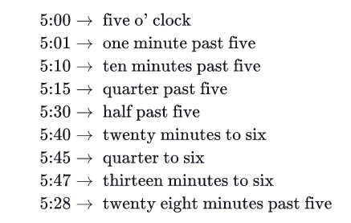

# The Time in Words

This problem can be found on [Hackerrank](https://www.hackerrank.com/challenges/the-time-in-words/problem)

## Introduction

Given the time in numerals we may convert it into words, as shown below:





At `minutes = 0` , use o' clock. For `1 <= minutes <= 30` , use past, and for `30 < minutes` use to. Note the space between the apostrophe and clock in o' clock. Write a program which prints the time in words for the input given in the format described.

## Function Description

The function has the following parameter(s):

h: an integer representing hour of the day

m: an integer representing minutes after the hour
Input Format

The first line contains , the hours portion The second line contains , the minutes portion


## Sample Inputs

### Sample Input 0

```bash
5
47
```

### Sample Output 0

```bash
thirteen minutes to six
```

### Sample Input 1

```bash
3
00
```

### Sample Output 1

```bash
three o' clock
```

### Sample Input 2

```bash
7
15
```

### Sample Output 2

```bash
quarter past seven
```
